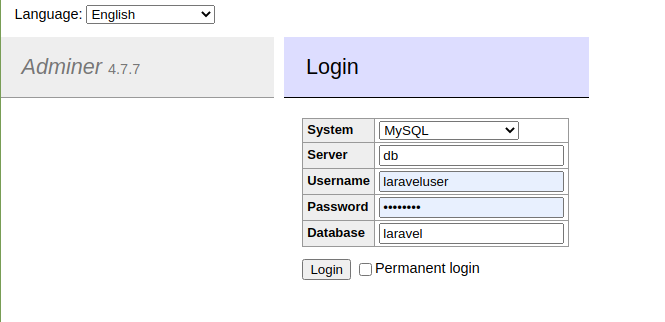

## Game Aplication

Application written in hexagonal architecture. This is a little game of transformation.

We will use docker for the virtualization of the application.

## Description

We will send messages to the server by post request with an attached XML in which we will send a user and a message.

An email with the request will be sent to the user's email address and we will respond with the pertinent response to the user's request in an XML format.

## Deploy

  To up the application we will use the command:

~~~
make up
~~~

 To stop the application we will use the command:

~~~
make pause
~~~
  To destroy all the container we will use the command:

~~~
make down
~~~
  To execute any command with [webpack](https://webpack.js.org/) we will use the command:

~~~
make init
~~~

## Package Manager

  To execute any command with artisan we will use the command:

~~~
make artisan command=xxxxx
~~~

  To execute any command with bash we will use the command:

~~~
make bash command=xxxxx
~~~

 To execute any command with [composer](https://packagist.org/) we will use the command:

~~~
make composer package=xxxxx 
~~~

  To execute any command with [npm](https://www.npmjs.com/) we will use the command:

~~~
make npm package=xxxxx
~~~
  To execute any command with php we will use the command:

~~~
make php command=xxxxx
~~~

## Testing

   To execute test unit in the application:

~~~
make test-unit
~~~

  To execute test integration in the application:

~~~
make test-integration
~~~

  To execute all test in the application:

~~~
make test-all
~~~

  To execute all test WITH COVERAGE in the application:

~~~
make test-coverage
~~~

  To execute mutant test in the application:

~~~
make test-mutant
~~~

## Manage Database

For the management of the database with interface we can use the adminer. Go to [localhost:8080](http://localhost:8080).

 
 
 When we initialize the project we create a new database user who is **laraveluser** and give it root permissions inside mysql to have any interactions with database.
 ## Manage Petition Http
 
 We use the file **web.http** to simulate Http Request. This file allows us to have the same functionalities as postman inside the project. 

## License

The application is open-sourced software licensed under the [MIT license](https://opensource.org/licenses/MIT).
